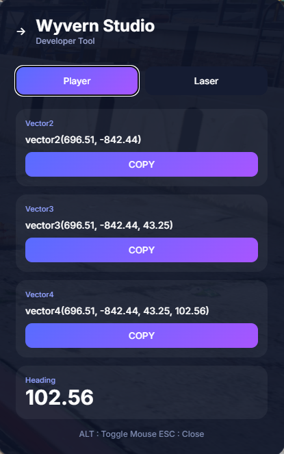

# 📍 Wyvern Coords (WCoords)

<p align="center">
  
</p>

<p align="center">
  <b>A modern, high-performance coordinates and entity inspection tool for FiveM developers.</b>
</p>

---

## 🚀 Features

**Wyvern Coords** is a lightweight developer tool designed to make mapping, scripting, and server debugging effortless.

*   **Player Tracking:** Real-time display of:
    *   `vector2` / `vector3` / `vector4` coordinates.
    *   Player Heading (Rotation).
*   **Laser Inspection Mode:** Point at any object, vehicle, or ped to see:
    *   Entity Type (Vehicle, Ped, Object).
    *   Model Name & Hash.
    *   Distance from player.
    *   Exact entity coordinates.
*   **Smart Copy-to-Clipboard:** One-click copy for all data formats (vector2, vector3, vector4).
*   **Modern UI:** A clean, dark-mode interface built with optimized NUI.
*   **Developer Friendly:** Easy to toggle with `/wcoords`.

---

## 📋 Requirements
This resource requires **[ox_lib](https://github.com/overextended/ox_lib)** to function properly (used for notifications and clipboard integration).

---

## 📥 Installation

1.  **Download** the latest release.
2.  **Ensure** you have `ox_lib` installed in your server resources.
3.  **Extract** the `wcoords` (or `wy-coords`) folder into your `resources` directory.
4.  **Add** the following to your `server.cfg`:
```cfg
ensure ox_lib
ensure wcoords

